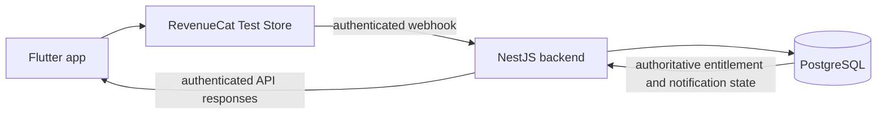

# Boo Pet Care

Boo Pet Care is a two-sided pet-care marketplace. Pet owners need a simple way to find suitable providers and manage service bookings; providers need a reliable workspace for their profiles, availability and booking obligations. Boo brings discovery, booking, chat and account notifications into one mobile app.

Owners can discover eligible providers, view profiles and services, create bookings, use booking chat, receive notifications and leave reviews. Providers can prepare their profile, services and working hours, manage booking lifecycle actions, use existing booking chat, record service payments and view ordinary dashboard statistics. Email confirmation and provider activation rules protect new marketplace work while existing obligations remain usable.

## Monetization

| Tier | Current entitlement | Current capability |
| --- | --- | --- |
| Free owner | None | One free pet profile plus discovery, booking, core chat, notifications and reviews. |
| Boo Plus | `boo_plus` | Additional pet profiles. Existing pets remain accessible if the membership expires. |
| Free provider | None | Provider profile, services, availability, booking dashboard and ordinary statistics. |
| Boo Pro | `boo_pro` | Advanced recorded-earnings insights from eligible completed paid services. |

The following proposed benefits remain **Coming soon**: pet health timelines, health-record export, care reminders, CareLoop rebooking, advanced booking analytics, private client notes, automated rebooking suggestions and featured listing. They are not represented as working premium functionality. Family sharing is deferred. Ads are deferred and are not implemented.

## RevenueCat Test Store

The Flutter client uses RevenueCat Test Store through `purchases_flutter`. The configured offerings are `owner_default` and `provider_default`; each has monthly and annual packages. The stable entitlements are `boo_plus` and `boo_pro`.

The authenticated Boo `users.id` UUID is the RevenueCat App User ID. Email addresses, roles, provider IDs, display names and anonymous RevenueCat IDs are never used as the App User ID. An owner can activate only `boo_plus`; a provider can activate only `boo_pro`. The client handles purchase, restore, expiry, logout and account switching through the RevenueCat service boundary and invalidates stale membership state.

The client membership state controls presentation and local feature access only. Future premium APIs must enforce access on the backend using authoritative subscription state.

## Backend entitlement projection

RevenueCat sends authenticated webhook events to `POST /webhooks/revenuecat`. The NestJS backend stores only safe event metadata and processes each RevenueCat event ID idempotently. Allowlisted entitlements are projected into `user_entitlements` for valid Boo user UUIDs, with role compatibility checks and event-timestamp ordering.

Pet creation is enforced transactionally by the backend:

- the first pet is free;
- additional pets require an active, unexpired `boo_plus` entitlement;
- the owner row is locked before counting and inserting;
- a free owner receives `403 Boo Plus is required to add another pet`;
- existing pets remain readable and editable after expiration.

The Flutter gate improves UX, but it is not the security boundary. Direct API requests are still checked by the backend.



## Setup

### Flutter

Install the Flutter SDK compatible with the Dart constraint in `pubspec.yaml`, then fetch packages:

```powershell
flutter pub get
```

Use placeholders for local Test Store development. Do not substitute production credentials:

```powershell
flutter run `
  --dart-define=API_BASE_URL=https://boo-backend.onrender.com `
  --dart-define=ONESIGNAL_APP_ID="<ONESIGNAL_APP_ID>" `
  --dart-define=REVENUECAT_TEST_STORE_API_KEY="<REVENUECAT_TEST_STORE_API_KEY>"
```

The Test Store key is development-only and must not be used in a production store release. Flutter must never receive `REVENUECAT_WEBHOOK_AUTH_TOKEN`, `REVENUECAT_PROJECT_ID`, `ONESIGNAL_REST_API_KEY`, `STREAM_API_SECRET` or database credentials.

### NestJS and PostgreSQL

From the backend repository, install Node dependencies and configure the environment using names only:

```powershell
cd ..\boo-backend
npm install
npm run build
```

Required configuration names include `DATABASE_URL`, `JWT_SECRET`, `JWT_REFRESH_SECRET`, `STREAM_API_KEY`, `STREAM_API_SECRET`, `RESEND_API_KEY`, `EMAIL_VERIFICATION_SECRET`, `PASSWORD_RESET_SECRET`, `ONESIGNAL_APP_ID`, `ONESIGNAL_REST_API_KEY`, `REVENUECAT_WEBHOOK_AUTH_TOKEN`, `REVENUECAT_PROJECT_ID`, `REVENUECAT_ALLOW_TEST_STORE`, `PORT`, `ALLOWED_ORIGINS`, `FRONTEND_URL` and `NODE_ENV`. Values belong in the backend environment and are never copied into this repository.

Before deploying entitlement tables, inspect the target database according to the SQL preflight instructions. After review, the operator may run the reviewed migration with a placeholder database variable:

```powershell
psql "$env:BOO_DATABASE_URL" -f sql/revenuecat_entitlements.sql
```

The local app uses `API_BASE_URL` for an override; the current default is `https://boo-backend.onrender.com`. Render should set its own backend environment and frontend CORS/origin values rather than placing server credentials in Flutter.

## Security

- Never commit webhook authorization tokens, database URLs, OneSignal REST keys, Stream secrets, JWT secrets, email secrets or production store credentials.
- Keep RevenueCat webhook authentication and project configuration server-side.
- Treat Test Store API keys as development-only.
- Do not use Flutter membership state as authorization for protected backend mutations.
- Push delivery remains best-effort; PostgreSQL notifications remain the authoritative in-app history.
- Push and notification payloads contain minimal identifiers and never sensitive chat, report, health or payment details.

## Testing and validation

The focused premium-access suite contains 15 tests covering free-tier access, role-safe Boo Plus/Boo Pro decisions, mismatched entitlements, expiry, account switching and upgrade-gate routing. The last recorded validation result is **15/15 passing**:

```powershell
flutter test test/premium_access_service_test.dart -r expanded
```

Useful focused Flutter commands:

```powershell
flutter test test/advanced_earnings_insights_test.dart -r expanded
flutter analyze --no-pub
git diff --check
```

Backend RevenueCat, webhook, entitlement and pet-service tests:

```powershell
cd ..\boo-backend
npm test -- --runInBand revenuecat/revenuecat-entitlements.service.spec.ts
npm test -- --runInBand pets/pets.service.spec.ts
npm run build
```

Automated tests use fake adapters and do not make purchases, send emails, execute deployment SQL or call a live webhook. Emulator verification is manual and must be recorded separately from automated validation.

## Demo checklist

- [ ] Free owner sees the first-pet path and creates one pet.
- [ ] A second pet shows the compact Boo Plus gate.
- [ ] An annual Test Store purchase activates `boo_plus` for the owner.
- [ ] The owner creates a second pet; the backend remains authoritative.
- [ ] A free provider retains ordinary dashboard statistics.
- [ ] Advanced earnings shows the compact Boo Pro gate.
- [ ] An annual Test Store purchase activates `boo_pro` for the provider.
- [ ] Advanced earnings displays truthful populated and empty states.
- [ ] Logout and account switching clear local premium state.
- [ ] Existing pets remain available after entitlement expiry.

## Screenshot placeholders

Approved screenshots can be added here without changing application behavior:

- Owner free-tier and first-pet flow: `[screenshot placeholder]`
- Boo Plus gate and active membership: `[screenshot placeholder]`
- Provider free dashboard: `[screenshot placeholder]`
- Boo Pro gate and advanced earnings: `[screenshot placeholder]`

## License

This repository is licensed under the [MIT License](LICENSE), Copyright (c) 2026 Imani Muchera.
